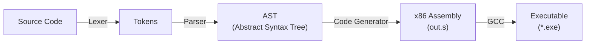

# Project: pasCal Compiler

**pasCal**은 절차적 프로그래밍 언어의 교육적 설계를 목표로 개발된 컴파일러 프로젝트입니다. C언어의 수식 표현과 Pascal 언어의 명확한 블록 구조를 결합하여 학습 용이성을 높였습니다.

---

## 1. 언어 개요 및 설계 의도 (Language Overview)

### 1.1 언어 명칭
* **pasCal** (Pascal + C)

### 1.2 설계 의도
컴파일러를 처음 학습하는 과정에서 파싱(Parsing)의 복잡도를 낮추면서도, 실용적인 프로그래밍이 가능한 언어를 설계하고자 했습니다.

1. **명확한 가독성 (Readability):** C언어의 중괄호(`{}`)는 가독성이 좋지만, 중첩될 경우 구조 파악이 어려울 수 있습니다. 이를 보완하기 위해 Pascal의 `begin ... end` 구조를 채택하여 블록의 시작과 끝을 명확히 했습니다.

2. **익숙한 표현식 (Familiarity):** 변수 선언, 대입, 산술/논리 연산은 대중적인 C언어 스타일(`int x;`, `x = a + b;`)을 따랐습니다.

3. **교육적 단순함 (Simplicity):** 함수(Function)와 같은 복잡한 스코프 개념을 배제하고, 제어문(`if`, `while`)과 수식 계산에 집중하여 컴파일러의 핵심 동작 원리(AST 생성 -> 코드 생성)를 명확히 구현했습니다.

---

## 2. 문법 정의 (Grammar Definition)

본 언어의 문법은 **EBNF (Extended Backus-Naur Form)** 표기법을 따릅니다.

### 2.1 프로그램 구조
프로그램은 `begin`으로 시작하여 `end.`로 종료됩니다.

$$
\begin{aligned}
\text{Program} &\rightarrow \textbf{begin} \;\; \text{StmtList} \;\; \textbf{end} \;\; \textbf{.}
\end{aligned}
$$

### 2.2 문장 (Statements)
문장들은 세미콜론(;)으로 구분되며, 순차적으로 실행됩니다.

$$
\begin{aligned}
\text{StmtList} &\rightarrow \text{Stmt} \\
&\mid \text{StmtList} \;\; \text{Stmt} \\
\\
\text{Stmt} &\rightarrow \text{Decl} \\
&\mid \text{Assign} \\
&\mid \text{Print} \\
&\mid \text{Loop} \\
&\mid \text{Condition} \\
&\mid \text{Block} \;\; \textbf{;}
\end{aligned}
$$

### 2.3 세부 규칙
제어문은 `do` 키워드를 사용하여 조건과 실행부를 구분합니다.

$$
\begin{aligned}
\text{Decl} &\rightarrow \textbf{int} \;\; \text{id} \;\; \textbf{;} \\
\text{Assign} &\rightarrow \text{id} \;\; \textbf{=} \;\; \text{Expr} \;\; \textbf{;} \\
\text{Print} &\rightarrow \textbf{print} \;\; \textbf{(} \;\; \text{Expr} \;\; \textbf{)} \;\; \textbf{;} \\
\text{Loop} &\rightarrow \textbf{while} \;\; \text{Expr} \;\; \textbf{do} \;\; \text{Stmt} \\
\text{Condition} &\rightarrow \textbf{if} \;\; \text{Expr} \;\; \textbf{do} \;\; \text{Stmt} \\
&\mid \textbf{if} \;\; \text{Expr} \;\; \textbf{do} \;\; \text{Stmt} \;\; \textbf{else} \;\; \textbf{do} \;\; \text{Stmt} \\
\text{Block} &\rightarrow \textbf{begin} \;\; \text{StmtList} \;\; \textbf{end}
\end{aligned}
$$

### 2.4 수식 및 연산자 (Expressions)
연산자 우선순위는 다음과 같습니다: $\text{not} > *, / > +, - > \text{비교} > \text{and} > \text{or}$

$$
\begin{aligned}
\text{Expr} &\rightarrow \text{Expr} \;\; \textbf{or} \;\; \text{Term} \mid \text{Term} \\
\text{Term} &\rightarrow \text{Term} \;\; \textbf{and} \;\; \text{Factor} \mid \text{Factor} \\
\text{Factor} &\rightarrow \textbf{not} \;\; \text{Factor} \mid \text{RelExpr} \\
\text{RelExpr} &\rightarrow \text{AddExpr} \;\; (\textbf{==} \mid \textbf{!=} \mid \textbf{<} \mid \textbf{>} \mid \textbf{<=} \mid \textbf{>=}) \;\; \text{AddExpr} \mid \text{AddExpr} \\
\text{AddExpr} &\rightarrow \text{AddExpr} \;\; (\textbf{+} \mid \textbf{-}) \;\; \text{MulExpr} \mid \text{MulExpr} \\
\text{MulExpr} &\rightarrow \text{MulExpr} \;\; (\textbf{*} \mid \textbf{/}) \;\; \text{Final} \mid \text{Final} \\
\text{Final} &\rightarrow \text{number} \mid \text{id} \mid \textbf{(} \;\; \text{Expr} \;\; \textbf{)}
\end{aligned}
$$

---

## 3. 전체 구조 (System Architecture)

본 컴파일러는 소스 코드를 입력받아 x86-64 어셈블리 코드를 생성하는 구조로 되어 있습니다.


### 3.1 모듈별 역할

1. **Lexer (`scanner.l`)**:
   * Flex를 이용하여 입력 문자열을 토큰(Token)으로 분리합니다.
   * 키워드(`begin`, `if`, `while` 등)와 연산자(`+`, `==`, `and` 등)를 식별합니다.

2. **Parser (`parser.y`)**:
   * Bison을 이용하여 토큰들의 구조를 분석(Parsing)합니다.
   * 문법 규칙에 따라 **AST(추상 구문 트리)**를 생성합니다.

3. **AST (`ast.c`, `ast.h`)**:
   * 프로그램의 구조를 트리 형태로 저장하는 자료구조입니다.
   * 노드 타입: `AST_ADD`, `AST_IF`, `AST_WHILE`, `AST_VAR_DECL` 등 정의.

4. **Code Generator (`codegen.c`)**:
   * 완성된 AST를 순회(Traversal)하며 타겟 머신(x86-64) 코드를 생성합니다.
   * **스택 머신(Stack Machine)** 모델을 사용하여 수식을 계산합니다.
   * OS 환경(Windows/Linux)에 따른 ABI(함수 호출 규약) 차이를 자동으로 처리합니다.

5. **Driver (`main.c`)**:
   * 파일 입출력 및 전체 컴파일 과정을 제어합니다.

## 4. 구현된 기능 및 제한 사항

### 4.1 구현된 기능 (Features)

* **자료형:** 정수형(`int`) 변수 선언 및 사용.
* **입출력:** 정수 출력을 위한 `print()` 내장 함수.
* **산술 연산:** 사칙연산(`+`, `-`, `*`, `/`) 및 괄호 처리.
* **비교 연산:** 6가지 비교 연산자(`==`, `!=`, `<`, `>`, `<=`, `>=`) 지원.
* **논리 연산:** `and`, `or`, `not` 연산 지원.
* **제어 흐름:**
    * `if ... do ... [else do ...]` 조건문.
    * `while ... do ...` 반복문.
    * 중첩된 `begin ... end` 블록 구조 지원.
* **플랫폼 호환성:** Windows(MinGW) 및 Linux 환경에서 모두 컴파일 가능한 어셈블리 생성.

### 4.2 미구현 및 제한 사항 (Limitations)

* **함수 미지원:** `main` 프로그램 외의 사용자 정의 함수나 프로시저를 만들 수 없습니다.
* **스코프 제한:** 모든 변수는 전역적으로 관리되며, 블록 내부의 지역 변수 스코프(Scope)가 구분되지 않습니다.
* **배열 및 포인터:** 단순 정수형 변수만 지원하며, 배열이나 포인터 연산은 불가능합니다.
* **에러 처리:** 문법 오류 발생 시 상세한 에러 메시지 없이 "syntax error"와 함께 종료됩니다.

## 5. 빌드 및 실행 방법 (Build & Usage)

### 5.1 의존성 (Dependencies)

본 프로젝트를 정상적으로 빌드하고 실행하기 위해서는 다음의 도구들이 설치되어 있어야 합니다.

* **GCC (GNU Compiler Collection):** C 소스 코드 컴파일 및 어셈블리 링킹을 위해 필요합니다.
* **Flex (Fast Lexical Analyzer Generator):** 어휘 분석기(`scanner.l`) 코드를 C 코드로 변환하는 데 필요합니다.
* **Bison (GNU Project Parser Generator):** 구문 분석기(`parser.y`) 코드를 C 코드로 변환하는 데 필요합니다.
* **Make:** 빌드 과정을 자동화하기 위해 필요합니다.
* **Standard C Library (libc):** 생성된 어셈블리 코드가 `printf` 등의 표준 함수를 호출하므로, 실행 시 라이브러리 의존성이 존재합니다.

### 5.2 빌드

```bash
make
```

### 5.3 실행

```bash
# 1. 소스 코드 컴파일 (어셈블리 생성)
./pasCal program.txt

# 2. 실행 파일 생성 (어셈블리 -> 실행 파일)
gcc -o program out.s

# 3. 결과 실행
./program.exe
```

### 5.4 테스트 (자동 실행)

```bash
make test
```
    